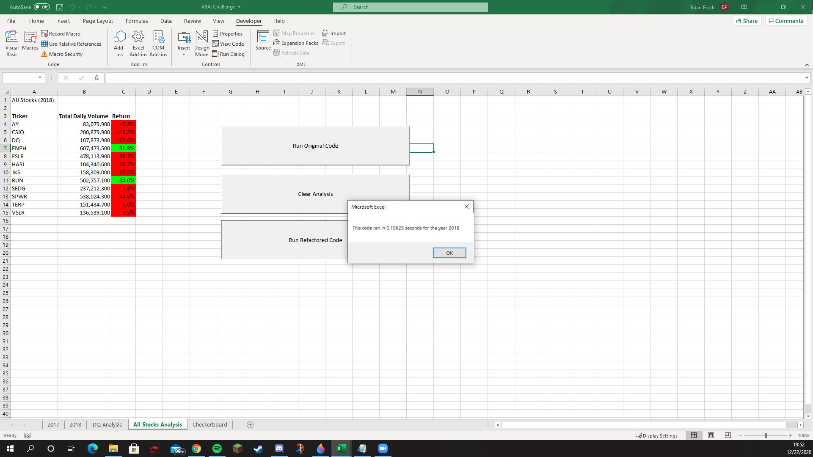
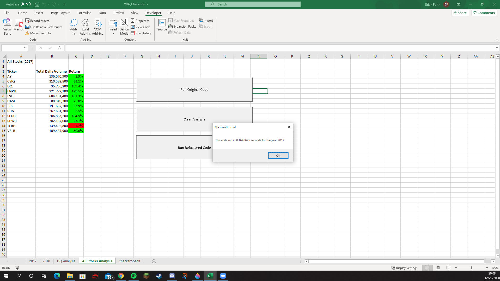

# An Analysis of Various Green Energy Companies
Module 2 of Data Analytics Bootcamp

## Scope
The goal of this project was to take a spreadsheet containing data on various green energy companies' stock performances over the 2017 and 2018 calendar years and, using Microsoft Excel and VBA, take the large amount of data and produce an automated, reproduceable analysis. The analysis was in service of the client, Steve, who sought to help his parents create an investment portfolio based on green energy companies.

## Analysis
The analysis looked at the stock prices of 12 different green energy companies over the years of 2017 and 2018. The scope of the analysis included over 6000 rows of data, and it was deemed prudent to automate the analysis using VBA. 

### The Code
At first, the code written to analyze the data used nested for loops to analyze the data for each company, but this resulted in some lines of code being run over 36000 times for a given year. So, using arrays, the code was refactored to iterate through the data once, rather than once per company. 

While the difference in runtime is relatively minor on this scale (less than 0.75 seconds), including more companies or more years in the analyses would see significantly differences in the runtime. That 0.75 seconds represents over 80% of the total runtime of the original code. The refactored code is over five times faster. That said, refactoring the code did take additional coding time, and also had the opportunity to introduce bugs into the code.

### The Findings
With the exceptions on Sunrun (NYSE: RUN) and TerraForm Power (NYSE: TERP), 2017 was a better year for all of the companies analyzed than was 2018, in term of raw percentage gains.

Additionally, 9 of the 12 companies saw gains in 2017 and losses in 2018, with the previously mentioned Terraform Power seeing losses in both years,and Sunrun and ENphase (NYSE: ENPH) seeing gains both years. With the caveat of past performance not guaranteeing future performance, both Enphase and Sunrun had sizeable trade volumes and significant stock growth over the two years analyzed.
